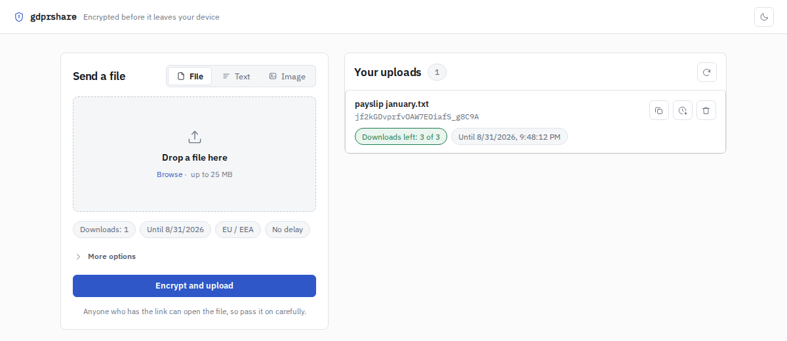
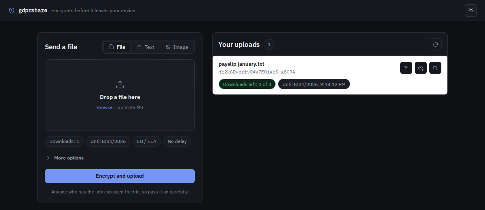

# gdprshare

  
  

Send someone a file without putting it in an email. The browser encrypts it
before it leaves the device, the server only ever holds ciphertext, and the
share deletes itself once it has been downloaded often enough or has sat around
long enough.

## DESCRIPTION

### Why not email

* transport encryption has known
  [issues](https://www.digicert.com/blog/striptls-attacks-and-email-security/),
  and MTA-STS is still not widespread: every MTA on the way has to be
  configured correctly for the hop to be secure
* end-to-end encryption is hard, especially between parties that never had
  contact before
* mail usually rests in an unencrypted mailbox, which may be breached later
* deleting mail is mostly reversible, shredding is rare
* some businesses have to archive mail with sensitive data for up to ten years,
  which an individual may not want

See also [GDPR Art. 5 (2.)](https://gdpr-info.eu/art-5-gdpr/) and
[GDPR Art. 24 (1.)](https://gdpr-info.eu/art-24-gdpr/) for the accountability
aspects.

### Encryption

* files are encrypted in the browser (AES-GCM) in fixed-size records, so a large
  file is never held whole, neither as plaintext nor as ciphertext. The record
  number is authenticated and the last record says that it is the last, so a
  stream that was reordered or cut short fails instead of decrypting to
  something. Nothing has to be shredded on the server after deletion
* a file larger than one record is sent as it is encrypted: the browser opens an
  upload, appends each record, and finishes it. The share exists from the first
  byte and is not downloadable until the last one, and one that is abandoned is
  swept once it is an hour old. A smaller file still goes in a single request,
  which is one round trip instead of three
* the key lives in the link fragment and never reaches the server
* the sender can add a password: the file is then encrypted under a key derived
  from the secret in the link and the password together (PBKDF2-SHA256), so a
  link that goes astray on its own opens nothing. The link carries a marker so
  the download page knows to ask, and the server never learns that a password is
  in play
* shredding the stored file as well is not implemented yet
* the web client cannot protect against a contaminated server or a malicious
  operator: the code doing the encrypting is served by that same server on every
  visit, so trusting the file means trusting whoever runs it. A client that is
  installed rather than served would not have that problem

### Limits on a share

* 1 to 15 downloads and 1 to 14 days, whichever runs out first
* both are enforced when the file is asked for, so a share stops on its last day
  rather than at the next cleanup sweep
* the sender can add days or downloads afterwards, never beyond what a fresh
  upload is allowed
* a link can be held back for a while before it starts working
* downloads can be limited to the EU/EEA, to countries with the same rules, or
  to a hand-picked list (needs a GeoIP database, see `geoippath`)
* uploads and downloads are rate limited per IP address
* `maxuploadsize` is the ceiling for a whole file, whether it arrives in one
  request or in pieces

### Metadata

Stripped in the browser, before anything is encrypted:

* images: EXIF and GPS data, always for the image type, opt-in for files
* GIFs: comment and XMP blocks, without touching the animation
* PDFs: document info and XMP data

A picture in a format that cannot be stripped is refused rather than uploaded
as it is.

### Records and notifications

* the sender is notified on each download attempt
* the notification carries the TLS version and ciphers of both sides, which is
  the evidence half of the accountability duty
* the same record is readable in the interface, under the sender's own uploads:
  one line per attempt, refusals included, with the reason a refused one did not
  go through. It lives as long as the share does and goes with it
* every attempt is kept, including the ones on a link that ran out, expired or
  whose file is gone. A share keeps at most 50 refusals, and the notifications
  stop with them, so a link someone keeps hammering cannot grow the database or
  the sender's mailbox without end

### What the visitor is told

The page footer carries a short data processing notice, built from the
configuration this server reports rather than from what the code could do: an
operator who leaves client info off gets a notice that says so. Each entry names
the data, why it is processed and when it goes. It cites
[Art. 5 (1) e](https://gdpr-info.eu/art-5-gdpr/) for the automatic deletion,
[Art. 32 (1) a](https://gdpr-info.eu/art-32-gdpr/) for the encryption, and
Art. 5 (2) with [Art. 24 (1)](https://gdpr-info.eu/art-24-gdpr/) for the
download records. It also covers the error reports the download page
sends when a link fails to open, which are dropped after two weeks and capped in
number, since that endpoint needs no token. `privacyurl` and `imprinturl` add
links to the operator's own pages; without them the footer says the rest is up
to whoever runs the server.

### The interface

* localized in 22 languages, picked from the browser's preferences. API errors
  carry a stable code, so the recipient reads them in their own language
* the options an upload was sent with come back for the next one, kept in the
  browser. The password is deliberately not among them
* follows the system light/dark preference and can be switched by hand
* fonts are served from the same host as the app, so no third party learns who
  is sending or downloading what
* a picture can be shown inline and taken off the screen again after a few
  seconds
* a file too large to assemble in the browser is written straight to disk, where
  the browser allows it (Chrome and Edge; elsewhere it is put together in the
  browser first). The page asks the server what the download would be before
  being one, so nothing is spent finding out that a link no longer works, and a
  large file waits for a click, since a browser only offers a place to save from
  one

### Handing over a share

Anyone holding the whole link can open the file, so treat the link as the file
itself. There are two ways to keep the two halves apart:

* set a password on the upload. The link stays complete, but it no longer opens
  anything by itself, and the password never touches this server. It cannot be
  recovered, so a lost password is a lost file
* or split the link: everything after the `#` is the secret, so send the link
  without that part and pass it on by another route, for example the link by
  email and the secret by phone

The download page asks for whichever half is missing. Both can be combined: a
split link to a share that also has a password asks for the secret first and the
password after it.

### Who may use it

Without `oidc` anyone who can reach the server can send a file, which is the
setup this started as. Turning it on puts an OpenID Connect provider in front:

    oidc:
        enabled:  true
        issuer:   'https://auth.example.org/realms/main'
        clientid: 'gdprshare'
        clientsecret: '...'
        redirecturl:  'https://share.example.org/auth/callback'
        protect: 'uploads'
        allowedgroups: ['staff']

`protect: uploads` asks the sender to sign in and leaves the recipient of a
share alone: they are the person a link was sent to, not a user of this server.
`protect: all` asks everyone, so a link only works for people the provider
knows. The bundle and the fonts stay open either way, since the download page is
built from them.

The login is the authorization code flow with PKCE. The ID token is read
straight from the provider's token endpoint over TLS, with this server
authenticating itself, which is the one case where OpenID Connect does not
require the client to check the token's signature ([Core 3.1.3.7][idtoken]); its
issuer, audience, expiry and the nonce this server sent are all checked.

[idtoken]: https://openid.net/specs/openid-connect-core-1_0.html#IDTokenValidation

A signed in visitor is a row in the database and the cookie carries nothing but
its id. There is deliberately no signed cookie: that would mean a secret which
could mint a session for anyone, and losing it would hand over every account at
once. Signing out ends a session for good, and expired ones go with the cleanup
sweep.

## REQUIREMENTS

### Client

* a current browser (Internet Explorer and pre-Chromium Edge are out)
* HTTPS, or localhost: the Web Crypto API the client encrypts with only exists
  in a secure context
* for a download of several hundred megabytes or more, a browser with the File
  System Access API (Chrome, Edge) writes it straight to disk. Firefox and
  Safari assemble it in the browser first, which is what bounds the size there

### Server

* nothing if built statically
* a container engine if run as a container image

### Building

* go compiler
* c compiler
* npm

## BUILDING

Build the binary:

    go build \
      -o gdprshare github.com/lixmal/gdprshare/cmd/gdprshare

or

    go build -ldflags="-extldflags=-static" \
      -o gdprshare github.com/lixmal/gdprshare/cmd/gdprshare

Afterwards build the js bundle:

    npm install
    npm run build

## RUN

Run locally:

    GIN_MODE=release ./gdprshare

gdprshare looks for a `config.yml` in its working directory; `gdprshare -config
<config file>` points it somewhere else.

Expired files are deleted by the server itself, every `cleanup.interval`
(1 hour by default), which is one less moving part in a container. The same
sweep clears uploads that were never finished, error reports past their
retention, and sessions that have run out. It erases what is left behind; a
download is already refused from the moment a share expires, whether or not a
sweep has run. Set `cleanup.enabled: false` to drive it from outside instead:
`gdprshare -cleanup` sweeps once and exits, and `misc/crontab` has an example
entry.
`misc/gdprshare.service` is an example systemd unit.

Alternatively run the [docker image](https://ghcr.io/lixmal/gdprshare):

    sudo docker run -p 8080:8080 -v conf/path:/conf -v data/path:/data ghcr.io/lixmal/gdprshare

The `/data` volume has to be writable by uid 1000, the user the image runs as,
and needs a `files` directory inside it (created automatically).

### TLS

Allow TLS 1.2 and above only. The server checks this itself: `tlsvalidation` in
`config.yml` sets the minimum version and a cipher blocklist, and refuses a
transfer that does not meet them. Behind a reverse proxy it reads the version
and cipher from the headers named under `header`, so the proxy has to set them.

## TRANSLATIONS

The interface ships in 22 languages, chosen from the browser's language
preferences; `?lang=<code>` overrides that. Adding a language means dropping a
`<code>.json` into `public/locales` and adding the code to `supportedLocales` in
`src/scripts/i18n.js`.

    npm run check:locales

fails when a language misses a key English has, keeps one English dropped, still
carries the English source string, loses a placeholder in translation, or when
the code asks for a key no locale defines. The unit tests go one further and
read the error codes out of the Go source, so a code the server can send with no
translation behind it fails as well. CI runs both on every pull request.
